<h3><code>manoj@github ~ $ ./contributions.sh</code></h3>

  

<h3><code>manoj@github ~ $ whoami</code></h3>
<table>
  <tr>
    <td valign="top"></td>
    <td valign="top"></td>
  </tr>
</table>

 

<a href="https://www.linkedin.com/in/manoj-kumar-choragudi-407b4b169">LinkedIn</a> ·
<a href="https://manojkumarchoragudi-portfolio.floot.app">Portfolio</a>

